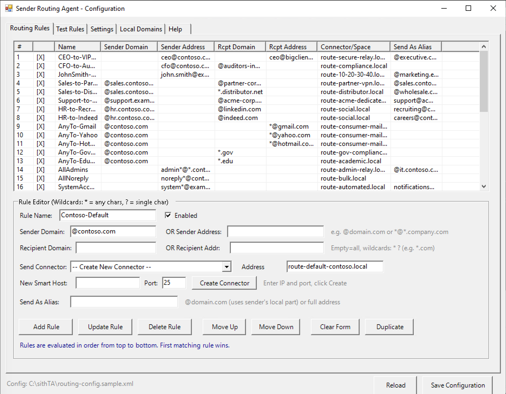
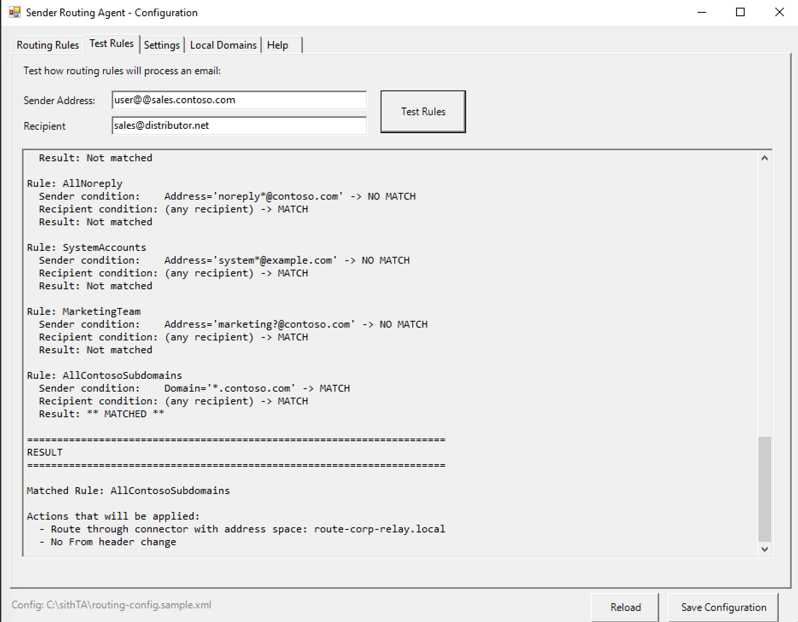
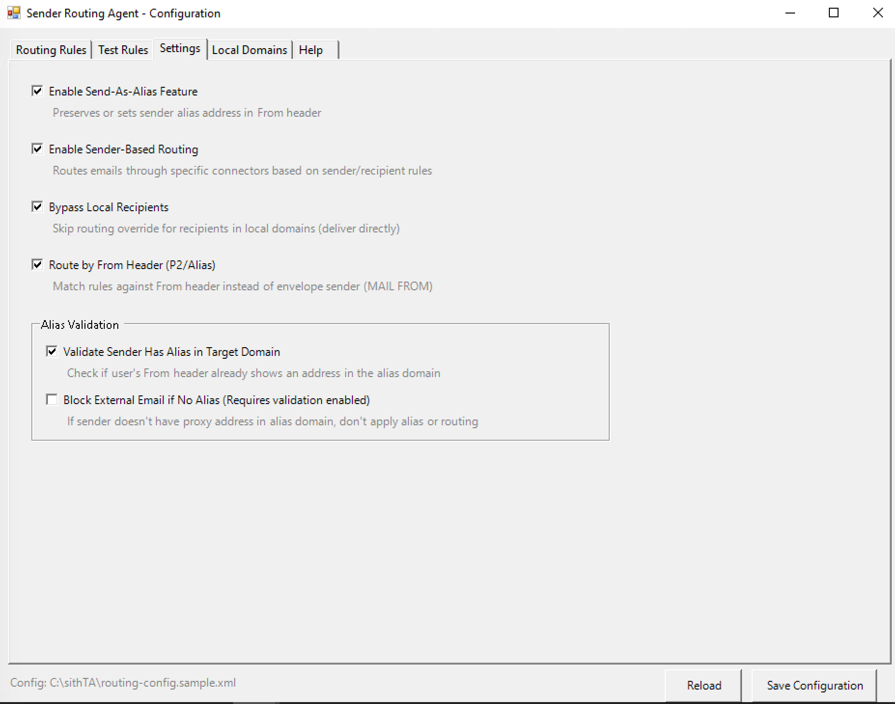
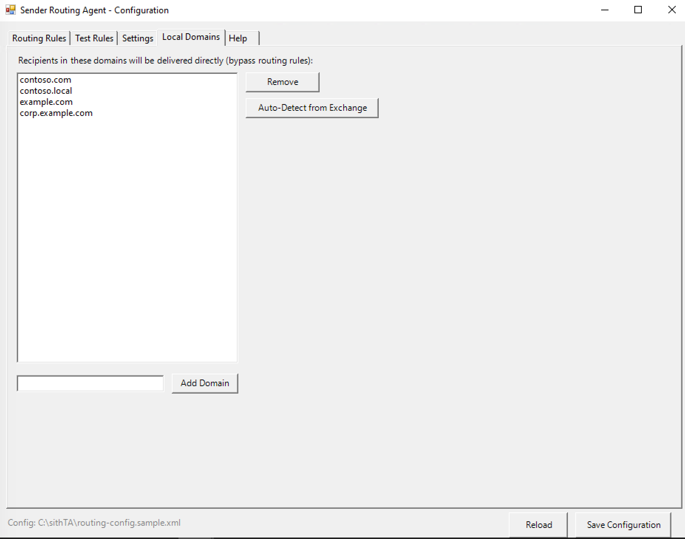

# Advanced Sender Based Routing Agent for Exchange 2019

A Microsoft Exchange 2019 Transport Agent that provides advanced sender-based routing and alias management with full support for recipient conditions and wildcard matching.

## Features

- **Send-As-Alias**: Preserves or sets sender's alias (proxy address) in both From header and Return-Path
- **Sender-Based Routing**: Routes emails through specific Send Connectors based on sender rules
- **Advanced Rules**: Combine sender AND recipient conditions in a single rule
- **Wildcard Support**: Use `*` (any characters) and `?` (single character) in all matching fields
- **Per-Recipient Routing**: Different routing decisions for different recipients in the same message
- **GUI Configuration**: Windows Forms GUI for easy rule management
- **Console Configuration**: Full-featured text-based configurator for Windows Server Core

## Screenshots

### Routing Rules
Create and manage routing rules with sender/recipient conditions and wildcards.



### Test Rules
Test your rules before deployment to verify they match correctly.



### Settings
Configure agent behavior and validation options.



### Local Domains
Manage local domains that bypass routing rules.



## Requirements

- Microsoft Exchange Server 2019 (also works with 2016)
- Windows PowerShell 5.1+
- .NET Framework 4.7.2 (for building from source)
- **Exchange Management Shell** must be run with **Administrator rights**
- User must have **Organization Management** role in Exchange

## Quick Start

### 1. Build the Agent

Copy Exchange DLLs from your server to `src/lib/`:
```
C:\Program Files\Microsoft\Exchange Server\V15\Public\
  - Microsoft.Exchange.Data.Common.dll
  - Microsoft.Exchange.Data.Transport.dll
```

Build:
```powershell
.\build.ps1
```

### 2. Install on Exchange Server

Copy the folder to your Exchange server, then in Exchange Management Shell:
```powershell
.\install.ps1
```

### 3. Configure Rules

Use the GUI configurator (Desktop):
```powershell
.\configure-gui.ps1
```

Or the console configurator (Server Core):
```powershell
.\configure.ps1
```

Or edit `routing-config.xml` directly.

## Configuration

### Basic Rule Example

Route emails from a domain through a specific connector:
```xml
<rule name="Sales-Route"
      senderDomain="@sales.company.com"
      addressSpace="route-sales-relay.local"
      sendAsAlias="@salesteam.com" />
```

### Advanced Rule with Recipient Condition

Route emails from sales TO partners through a specific relay:
```xml
<rule name="Sales-to-Partner"
      senderDomain="@sales.company.com"
      recipientDomain="@partner.com"
      addressSpace="route-partner-relay.local"
      sendAsAlias="@external.company.com" />
```

### Rule with Specific Addresses

Route emails from a specific user to a specific recipient:
```xml
<rule name="CEO-to-VIP"
      senderAddress="ceo@company.com"
      recipientAddress="vip@important-client.com"
      addressSpace="route-secure-relay.local" />
```

### Wildcard Examples

```xml
<!-- Match any subdomain -->
<rule senderDomain="*.company.com" ... />

<!-- Match specific pattern -->
<rule senderAddress="admin*@company.com" ... />

<!-- Match recipient pattern -->
<rule recipientDomain="*.mail-tester.com" ... />

<!-- Match any Gmail recipient -->
<rule recipientAddress="*@gmail.com" ... />
```

### Configuration Settings

```xml
<settings>
  <!-- Enable/disable features -->
  <enableSendAsAlias>true</enableSendAsAlias>
  <enableSenderBasedRouting>true</enableSenderBasedRouting>

  <!-- Skip routing for internal recipients -->
  <bypassLocalRecipients>true</bypassLocalRecipients>

  <!-- Match rules against From header instead of envelope sender -->
  <routeByHeaderFrom>true</routeByHeaderFrom>

  <!-- Validate sender has alias in proxy addresses -->
  <validateProxyAddresses>true</validateProxyAddresses>
  <blockIfNoAlias>false</blockIfNoAlias>
</settings>
```

### Logging Configuration

Enable file logging for troubleshooting and monitoring:

```xml
<logging>
  <!-- Enable/disable file logging -->
  <enableFileLogging>true</enableFileLogging>

  <!-- Log level: None, Error, Warning, Info, Debug, Verbose -->
  <logLevel>Info</logLevel>

  <!-- Custom log path (leave empty for default Exchange logs folder) -->
  <logPath></logPath>

  <!-- Maximum log file size in MB before rotation -->
  <maxLogFileSizeMB>10</maxLogFileSizeMB>

  <!-- Number of rotated log files to keep -->
  <maxLogFiles>5</maxLogFiles>
</logging>
```

**Log Levels:**
- `None` - No logging
- `Error` - Only errors
- `Warning` - Errors and warnings
- `Info` - Normal operation messages (recommended for production)
- `Debug` - Detailed debugging information
- `Verbose` - All messages including detailed tracing

**Default Log Location:**
```
C:\Program Files\Microsoft\Exchange Server\V15\TransportRoles\Logs\AdvancedSenderRouting\
```

**Log Format:**
```
2024-01-15 10:30:45.123 [INFO] Processing message from user@company.com
2024-01-15 10:30:45.125 [INFO] Rule 'Sales-Route' matched sender domain @sales.company.com
```

## Rule Evaluation

- Rules are evaluated **top-to-bottom** (first rule = highest priority)
- **First matching rule wins** - no further rules are checked
- Each recipient is evaluated independently for routing decisions
- Rules without recipient conditions match all recipients

## Scripts

| Script | Description |
|--------|-------------|
| `build.ps1` | Compiles the agent DLL from source |
| `install.ps1` | Installs and enables the transport agent |
| `uninstall.ps1` | Removes the transport agent |
| `configure.ps1` | Console-based configuration manager (Server Core) |
| `configure-gui.ps1` | GUI configuration manager (Desktop) |

## Project Structure

```
sithTA/
├── README.md
├── LICENSE
├── build.ps1
├── install.ps1
├── uninstall.ps1
├── configure.ps1
├── configure-gui.ps1
├── routing-config.xml      # Configuration file
│
└── src/
    ├── SenderRoutingAgent.csproj
    ├── SenderRoutingAgent.cs
    ├── SenderRoutingAgentFactory.cs
    ├── Configuration/
    │   └── RoutingConfig.cs
    └── lib/                 # Copy Exchange DLLs here
        ├── Microsoft.Exchange.Data.Common.dll
        └── Microsoft.Exchange.Data.Transport.dll
```

## How It Works

### Send-As-Alias

When a user sends email using an alias (proxy address), Exchange normally rewrites the From header to their primary SMTP address. This agent:

1. Detects when sender is using an alias
2. Sets the From header (P2) to the alias address
3. Sets the Return-Path/MAIL FROM (P1/envelope sender) to the alias address
4. Optionally validates the user has the alias in their proxy addresses

**Note:** Both the From header and Return-Path are updated to ensure consistent sender identity and proper SPF alignment when using alias domains.

### Sender-Based Routing

Exchange routes outbound email based on recipient domain. This agent:

1. Intercepts messages after recipient resolution
2. Matches sender/recipient against configured rules (with wildcard support)
3. Overrides routing to use a specific Send Connector's address space
4. Supports per-recipient routing decisions (different recipients can use different routes)

### Advanced Rules

Rules can specify both sender AND recipient conditions:

- **Sender conditions**: `senderDomain` or `senderAddress`
- **Recipient conditions**: `recipientDomain` or `recipientAddress` (optional)
- If no recipient condition is specified, the rule matches all recipients
- All fields support wildcards (`*` and `?`)

## Troubleshooting

### Check Agent Status
```powershell
Get-TransportAgent "Advanced Sender Based Routing Agent"
```

### View Logs

**File Logs (recommended):**

Enable file logging in configuration for detailed troubleshooting:
```powershell
# View latest log entries
Get-Content "C:\Program Files\Microsoft\Exchange Server\V15\TransportRoles\Logs\AdvancedSenderRouting\AdvancedSenderRouting.log" -Tail 100

# Or use the configurator
.\configure.ps1       # Option 5 > View Log
.\configure-gui.ps1   # Logging tab > View Log
```

**Event Log:**
```powershell
# Application log
Get-EventLog -LogName Application -Source MSExchangeTransport -Newest 50 |
    Where-Object { $_.Message -like "*AdvancedSenderRouting*" }

# Or in Event Viewer:
# Windows Logs > Application > Filter by Source: MSExchangeTransport
```

### Restart After Config Changes
```powershell
Restart-Service MSExchangeTransport
```

### Common Issues

**From header not changing:**
- Enable file logging with `Debug` level to see detailed processing
- Check `sendAsAlias` format: use `@domain.com` or `user@domain.com`
- Verify `validateProxyAddresses` setting
- Check log files for "Send-As-Alias" entries

**Routing not working:**
- Enable file logging with `Debug` level to see rule matching
- Verify Send Connector exists with matching address space
- Check if recipient is in local domains (bypassed by default)
- Use the "Test Rules" feature in the configurator to debug

**Wildcards not matching:**
- Ensure pattern format is correct (e.g., `*.domain.com` not `*domain.com`)
- Use the "Test Rules" feature to verify pattern matching
- Enable `Verbose` logging to see detailed pattern matching

**Log files not appearing:**
- Verify `enableFileLogging` is set to `true`
- Check the configured log path exists and is writable
- Restart MSExchangeTransport service after config changes

## License

MIT License - See [LICENSE](LICENSE) file for details.

## Contributing

1. Fork the repository
2. Create a feature branch
3. Make your changes
4. Submit a pull request

## Support

For issues and feature requests, please use the GitHub Issues page.
